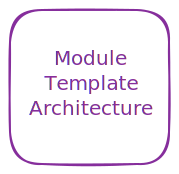

# Teras Module
Lorem ipsum...

## Table of Contents
1. [Architecture](#architecture)
2. [Usage](#usage)
3. [Requirements](#requirements)
4. [Providers](#providers)
5. [Inputs](#inputs)
6. [Outputs](#outputs)

## Architecture
The below diagram provides an overview of the resources deployed in this module:



## Usage
Example minimal deployment using module defaults:
```
module "teras_module" {
  source  = "..."
  version = "..."

  variable_a = "..."
  varialbe_b = "..."
}
```

| :scroll: Note: Defaults |
|----------|
| See [inputs](#inputs) for a complete list of input variables and their defaults. |

<!-- BEGINNING OF PRE-COMMIT-TERRAFORM DOCS HOOK -->
## Requirements

No requirements.

## Providers

No providers.

## Modules

No modules.

## Resources

No resources.

## Inputs

No inputs.

## Outputs

No outputs.
<!-- END OF PRE-COMMIT-TERRAFORM DOCS HOOK -->
